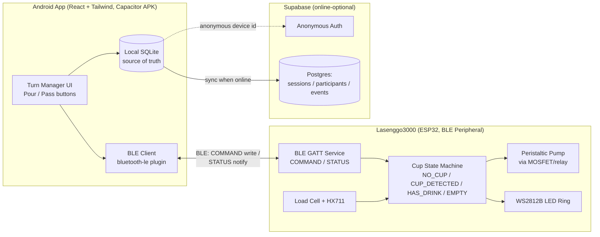

# ARCHITECTURE.md — Lasenggo 3000

## System Diagram


## Tech Stack Decisions

| Layer | Choice | Why |
|---|---|---|
| Frontend | React + Tailwind | Team familiarity; fast UI iteration |
| Native wrapper | Capacitor → Android APK | Avoids Web Bluetooth's unreliability/iOS lockout; ships as installable app |
| Bluetooth | `@capacitor-community/bluetooth-le` (native BLE) | No internet dependency (rural/outdoor use case); more reliable than browser Web Bluetooth |
| Local storage | SQLite (`@capacitor-community/sqlite`) | Offline-first source of truth; schema maps directly to Supabase/Postgres, so sync is a straight row copy, not a transform |
| Cloud sync | Supabase (Postgres + anonymous auth) | Online-optional; zero-login UX fits casual party use; Postgres gives real querying for future stats |
| Firmware target | ESP32 | Built-in BLE, enough GPIO/ADC for pump + load cell + LED, no separate Arduino needed |

## Key Design Patterns
- **Hardware stays "dumb"**: turn order and participant logic live entirely in the app.
  The ESP32 only executes `POUR`/`TARE`/`STOP` and reports sensor state — it has no
  concept of "whose turn it is." Keeps firmware simple and keeps all business logic in
  one place (the app) for easier iteration.
- **Delta-based sensing, not fixed thresholds**: cup presence/liquid detection compares
  weight *before* vs *after* a pour rather than relying on fixed absolute weight bands.
  This makes the system agnostic to whatever cup/glass shape someone brings to the
  circle — a core requirement given how tagayan is actually used.
- **Offline-first, sync-second**: every write goes to local SQLite first and always
  succeeds. Supabase sync is a best-effort background process; the app's core loop
  (list → pour/pass → confirm) never blocks on network state.
- **Event log, not aggregate-only**: the data model stores individual pour/pass events,
  not just summary counts. Summaries are derived via query; the reverse is impossible.
  This keeps the door open for future stats features without a schema migration.

## Data Models / Schema

```sql
-- One row per tagayan session (a "party"/gathering)
sessions (
  id uuid primary key,
  device_id text,            -- anonymous auth user id
  started_at timestamptz,
  ended_at timestamptz,
  synced_at timestamptz      -- null until successfully pushed to Supabase
)

-- One row per participant per session
participants (
  id uuid primary key,
  session_id uuid references sessions(id),
  name text
)

-- One row per pour/pass event
events (
  id uuid primary key,
  session_id uuid references sessions(id),
  participant_id uuid references participants(id),
  type text,                 -- 'POUR' | 'PASS'
  timestamp timestamptz
)
```
Local SQLite mirrors this exactly, plus a `synced boolean` flag per row used by the sync
job to find unsynced records.

## BLE API (App ↔ ESP32)

Custom GATT service, advertised as `"Lasenggo3000"`.

**COMMAND characteristic (Write, App → ESP32):**
| Command | Meaning |
|---|---|
| `POUR` | Trigger pour for current person at the configured volume |
| `TARE` | Re-zero the load cell |
| `STOP` | Emergency stop pump mid-pour |

**STATUS characteristic (Notify, ESP32 → App):**
| Status | Meaning |
|---|---|
| `READY` | Idle, no cup |
| `CUP_DETECTED` | Cup placed, empty |
| `NO_CUP` | Pour attempted, no cup — rejected |
| `POURING` | Pump active |
| `POURED` | Pour completed |
| `HAS_DRINK` | Liquid confirmed (LED on) |
| `EMPTY` | Cup emptied/removed (LED off) |

Any change to this command/status vocabulary must be reflected here and in firmware +
app code in the same PR — this table is the contract between the two codebases.

## Feature-Based Architecture (app folder structure)
Scaffolded and live as of `app/project-scaffold` (2026-10-05) — React + Tailwind v4 +
Capacitor project with this structure in place under `src/`, confirmed running via
`npm run dev`:
```
src/
  features/
    session/        # participant list, turn manager, session lifecycle
    pour/            # pour volume setting, pour/pass actions, BLE command dispatch
    ble/             # BLE connection, scan, characteristic read/write/subscribe
    storage/         # SQLite schema, local read/write, sync queue
    sync/            # Supabase client, anonymous auth, push/pull sync job
  shared/
    components/      # shared UI (buttons, status indicators)
    hooks/
    types/
```
Each feature folder owns its own state/logic; cross-feature calls go through a small
explicit interface rather than reaching into another feature's internals. Folders are
currently empty scaffolding (`.gitkeep` only) pending the feature tasks in `TASKS.md`.

## References
- Full original decision log/rationale: see `DECISIONS.md`
- Sensor/component list: see `PRD.md`
- Task breakdown: see `TASKS.md`
